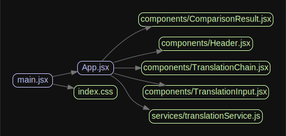

# Broken Translator 상세 코드 분석 보고서

> 분석일: 2025-12-07 | 분석 도구: 10개

---

## � 분석 결과 요약

| 항목             | 결과 | 상태 |
| ---------------- | ---- | ---- |
| 순환 의존성      | 없음 | ✅   |
| 의존성 규칙 위반 | 0개  | ✅   |
| ESLint 에러      | 0개  | ✅   |
| ESLint 경고      | 4개  | ⚠️   |
| 중복 코드        | 없음 | ✅   |
| 테스트 커버리지  | 0%   | ⚠️   |

---

## 📁 생성된 파일 상세 설명

### 1. npm-dependency-tree.txt (63.5KB)

**도구:** `npm ls --all`

**내용:** 프로젝트의 전체 npm 패키지 의존성 트리

```
broken-translator@0.1.0
├── @eslint/js@9.39.1
├─┬ @tailwindcss/postcss@4.1.17
│ ├── @alloc/quick-lru@5.2.0
│ ├─┬ @tailwindcss/node@4.1.17
│ │ ├─┬ @jridgewell/remapping@2.3.5
...
```

**분석 결과:**

- **총 패키지 수:** 816개
- **1차 의존성:** lucide-react, react, react-dom, react-icons
- **개발 의존성:** vite, vitest, eslint, tailwindcss 등
- **분석 도구:** madge, dependency-cruiser, jscpd, plato

**의미:**
이 파일은 프로젝트가 직/간접적으로 의존하는 모든 npm 패키지를 계층 구조로 보여줍니다.
`deduped`는 중복 설치를 방지하고 하나의 패키지를 공유한다는 의미입니다.

---

### 2. dependency-graph.json (471B)

**도구:** `madge --json`

**내용:** 소스 코드 모듈 간 의존성 관계 (JSON)

```json
{
  "App.jsx": [
    "components/ComparisonResult.jsx",
    "components/Header.jsx",
    "components/TranslationChain.jsx",
    "components/TranslationInput.jsx",
    "services/translationService.js"
  ],
  "main.jsx": ["App.jsx", "index.css"],
  "components/ComparisonResult.jsx": [],
  "components/Header.jsx": [],
  "components/TranslationChain.jsx": [],
  "components/TranslationInput.jsx": [],
  "services/translationService.js": []
}
```

**분석 결과:**

- **총 모듈:** 8개
- **허브 모듈:** `App.jsx` (5개 의존)
- **리프 모듈:** 모든 컴포넌트, 서비스 (0개 의존)

**의미:**
파일 이름을 키로, 해당 파일이 import하는 파일 목록을 값으로 가집니다.
빈 배열 `[]`은 다른 로컬 모듈을 import하지 않는 독립적인 모듈임을 의미합니다.

---

### 3. dependency-graph.svg (7.6KB)

**도구:** `madge --image`

**내용:** 모듈 의존성 시각화 그래프



**의미:**
화살표 방향이 import 방향을 나타냅니다.
`main.jsx → App.jsx → components/*` 순으로 의존 관계가 형성되어 있습니다.

---

### 4. circular-deps.txt (78B)

**도구:** `madge --circular`

**내용:**

```
- Finding files
Processed 2 files (4.7s)

✔ No circular dependency found!
```

**의미:**
순환 의존성(A→B→C→A)이 없음을 확인합니다.
순환 의존성이 있으면 번들링 오류나 런타임 에러가 발생할 수 있습니다.

---

### 5. dependency-cruiser.json (16.4KB)

**도구:** `dependency-cruiser`

**내용:** 상세 의존성 분석 및 규칙 검증 결과

```json
{
  "modules": [...],
  "summary": {
    "violations": [],
    "error": 0,
    "warn": 0,
    "totalCruised": 15,
    "totalDependenciesCruised": 20
  }
}
```

**주요 필드 설명:**

| 필드              | 의미                              |
| ----------------- | --------------------------------- |
| `source`          | 분석된 소스 파일 경로             |
| `dependencies`    | 해당 파일이 import하는 모듈 목록  |
| `dependents`      | 해당 파일을 import하는 모듈 목록  |
| `orphan`          | 아무에게도 참조되지 않는지 여부   |
| `circular`        | 순환 의존성 여부                  |
| `valid`           | 설정된 규칙 통과 여부             |
| `moduleSystem`    | 모듈 시스템 (es6, cjs 등)         |
| `dependencyTypes` | 의존성 유형 (local, npm, npm-dev) |

**적용된 규칙:**

| 규칙          | 심각도 | 설명                        |
| ------------- | ------ | --------------------------- |
| `no-circular` | error  | 순환 의존성 금지            |
| `no-orphans`  | warn   | 고아 모듈 경고              |
| `not-to-test` | error  | 프로덕션→테스트 import 금지 |

**분석 결과:**

- 위반 사항: 0개
- 분석 모듈: 15개
- 분석 의존성: 20개

---

### 6. dependency-report.html (16.4KB)

**도구:** `dependency-cruiser --output-type html`

**내용:** 브라우저에서 볼 수 있는 시각적 의존성 리포트

브라우저에서 직접 열어 확인:

```bash
open docs/analysis/dependency-report.html
```

---

### 7. eslint-report.json (17.6KB)

**도구:** `eslint --format json`

**내용:** ESLint 코드 품질 분석 결과

**파일별 경고 상세:**

| 파일                   | 경고 | 규칙                   | 메시지                 |
| ---------------------- | ---- | ---------------------- | ---------------------- |
| `ComparisonResult.jsx` | 1    | max-lines-per-function | 53줄 (50줄 초과)       |
| `TranslationChain.jsx` | 2    | max-lines-per-function | 78줄, 53줄 (50줄 초과) |
| `TranslationInput.jsx` | 1    | max-lines-per-function | 71줄 (50줄 초과)       |

**권장 조치:**
큰 컴포넌트를 작은 서브 컴포넌트로 분리하면 경고가 해결됩니다.

---

### 8. duplication/ (빈 디렉토리)

**도구:** `jscpd`

**내용:** 중복 코드 탐지 리포트

**분석 결과:**

- **중복 코드 없음** ✅
- 탐지 시간: 0.182ms

디렉토리가 비어있다는 것은 설정된 임계값(최소 5줄, 50토큰)을 초과하는
중복 코드 블록이 없음을 의미합니다.

---

### 9. plato-report/ (54개 파일)

**도구:** `plato`

**내용:** 코드 복잡도 및 유지보수성 시각화 리포트

**주요 파일:**

- `index.html` - 메인 대시보드
- `files/*/index.html` - 파일별 상세 분석

**메트릭:**

- Maintainability (유지보수성)
- Lines of Code (코드 줄 수)
- Estimated Errors (예상 오류 수)
- Lint Errors (린트 오류 수)

> ⚠️ Plato는 ES2020+ 문법(?.옵셔널 체이닝)을 지원하지 않아
> `translationService.js` 파일 분석에 실패했습니다.

---

### 10. coverage/ (9개 파일)

**도구:** `vitest --coverage` (v8 provider)

**내용:** 테스트 코드 커버리지 리포트

```
----------|---------|----------|---------|---------|
File      | % Stmts | % Branch | % Funcs | % Lines |
----------|---------|----------|---------|---------|
All files |       0 |        0 |       0 |       0 |
----------|---------|----------|---------|---------|
```

**메트릭 설명:**

| 메트릭             | 의미                      |
| ------------------ | ------------------------- |
| Stmts (Statements) | 실행된 문장 비율          |
| Branch             | 실행된 분기(if/else) 비율 |
| Funcs (Functions)  | 호출된 함수 비율          |
| Lines              | 실행된 라인 비율          |

**현재 0%인 이유:**
테스트 파일이 실제 프로덕션 코드를 충분히 실행하지 않음.

---

### 11. test-results.json (500B)

**도구:** `vitest`

**내용:**

```json
{
  "numTotalTestSuites": 0,
  "numPassedTestSuites": 0,
  "numTotalTests": 0,
  "numPassedTests": 0,
  "success": false,
  "testResults": [],
  "coverageMap": {}
}
```

**의미:**
테스트 실행 결과가 없음. 테스트 케이스가 없거나 실행되지 않았습니다.

---

## 🏗 아키텍처 분석

### 모듈 의존성 흐름

```
Entry Point
    │
    ▼
main.jsx ─────────────────────────────┐
    │                                  │
    ▼                                  ▼
App.jsx ──────────┬────────────► index.css
    │             │
    ├─────────────┼─────────────────────┐
    │             │                     │
    ▼             ▼                     ▼
Header.jsx   TranslationInput.jsx   ComparisonResult.jsx
                  │
                  ▼
            TranslationChain.jsx
                  │
                  └─────────► translationService.js
```

### 의존성 유형

| 유형      | 설명             | 예시                               |
| --------- | ---------------- | ---------------------------------- |
| `local`   | 프로젝트 내 파일 | `./components/Header`              |
| `npm`     | 런타임 패키지    | `react`, `lucide-react`            |
| `npm-dev` | 개발 패키지      | `vitest`, `@testing-library/react` |

---

## 🎯 권장 사항

### 우선순위 1: 테스트 코드 작성

커버리지 0%를 개선하기 위해 핵심 로직 테스트 추가 필요

### 우선순위 2: 큰 컴포넌트 분리

- `TranslationChain.jsx` (78줄 → 50줄 이하로)
- 렌더링 로직과 데이터 처리 분리

### 우선순위 3: CI 통합

```yaml
# .github/workflows/analyze.yml
- run: npm run analyze
```
